# 空气质量（PM2.5）统计建模与可视化分析

> **概率论与数理统计（2025-2026 春季学期）** | 授课教师：刘立群
>
> 基于空气质量的多元统计推断项目，综合运用描述统计、假设检验、相关分析、多重回归与时间序列平稳性检验，生成 19 张达到 Nature/Science 期刊标准的出版级可视化图表。

---

## 一、研究背景与问题

PM2.5 是衡量空气质量的核心指标。本研究基于 65 条观测记录（覆盖春、夏、秋、冬四季），从**温度、湿度、风速、交通指数**四个维度出发，系统回答以下统计问题：

1. PM2.5 及各预测变量的分布特征与季节差异如何？
2. 哪些气象和交通因素与 PM2.5 存在显著相关关系？
3. 不同季节之间的 PM2.5 浓度差异是否具有统计学显著性？
4. 多元线性回归模型能否有效预测 PM2.5？模型假设是否满足？
5. 各变量的时间序列是否平稳？是否存在单位根？

---

## 二、数据概况

### 2.1 变量说明

| 变量名 | 含义 | 单位 | 取值范围 |
|---|---|---|---|
| `pm25` | PM2.5 浓度（**因变量**） | μg/m³ | 5.0 – 154.4 |
| `temperature` | 气温 | °C | -10.8 – 32.5 |
| `humidity` | 相对湿度 | % | 20.0 – 89.7 |
| `wind_speed` | 风速 | m/s | 0.5 – 7.78 |
| `traffic_index` | 交通拥堵指数 | — | 40 – 120 |
| `season` | 季节（春/夏/秋/冬） | — | 4 类 |

- 样本量：**65 条**，无缺失值
- 季节分布：春（20）、夏（12）、秋（19）、冬（14）

### 2.2 描述统计

| 变量 | 均值 | 标准差 | 中位数 | 偏度 | 正态性（Shapiro p） |
|---|---|---|---|---|---|
| PM2.5 | 49.47 | 38.76 | 39.20 | 1.077 | **非正态**（p < 0.001） |
| 气温 | 16.26 | 9.23 | 16.20 | -0.584 | 正态（p = 0.083） |
| 湿度 | 57.30 | 15.29 | 56.90 | -0.107 | 正态（p = 0.789） |
| 风速 | 3.67 | 1.75 | 3.67 | 0.019 | 正态（p = 0.493） |
| 交通指数 | 70.34 | 16.71 | 69.00 | 0.630 | 正态（p = 0.089） |

> PM2.5 呈右偏分布（偏度 = 1.077），是唯一未通过正态性检验的变量，后续应使用非参数方法补充检验。

---

## 三、方法论

### 分析流程

```
原始数据
  ├── 第一步：探索性数据分析（EDA）与描述统计
  ├── 第二步：正态性检验（Shapiro-Wilk / D'Agostino）
  ├── 第三步：相关分析（Pearson / Spearman）
  ├── 第四步：季节差异检验（ANOVA / Kruskal-Wallis / 事后比较）
  ├── 第五步：多元线性回归建模（OLS + 诊断）
  └── 第六步：时间序列平稳性检验（ADF / KPSS / ACF-PACF）
```

### 检验方法详述

| 方法 | 原假设 H₀ | 备择假设 H₁ | 用途 |
|---|---|---|---|
| Shapiro-Wilk | 数据服从正态分布 | 不服从 | 分布检验 |
| Pearson 相关 | 总体相关系数 ρ = 0 | ρ ≠ 0 | 线性相关 |
| Spearman 相关 | 总体秩相关 ρ = 0 | ρ ≠ 0 | 单调相关（非参数） |
| 单因素方差分析 | 各季节均值相等 | 至少一组不同 | 组间差异 |
| Kruskal-Wallis | 各组分布相同 | 至少一组不同 | 非参数方差分析 |
| Welch t 检验 | 两组均值相等 | 不等 | 事后两两比较 |
| Bonferroni 校正 | — | — | 多重比较校正 |
| OLS 回归 | 回归系数 = 0 | ≠ 0 | 多元线性建模 |
| VIF | — | — | 多重共线性诊断 |
| **ADF 检验** | **存在单位根（非平稳）** | **平稳** | **时间序列平稳性** |
| **KPSS 检验** | **平稳** | **非平稳** | **ADF 互补检验** |

---

## 四、可视化结果与解读

### 第一部分：基础可视化（图 1–6）

---

#### 图 1：各变量分布直方图与核密度估计

<p align="center">
  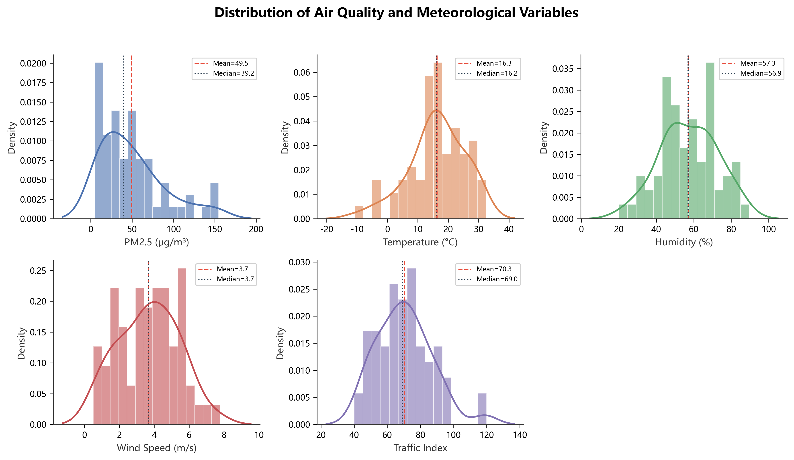
</p>

**解读：** 本图展示了 PM2.5 及四个预测变量的频率分布。蓝色直方图表示实际频率，叠加的平滑曲线为核密度估计（KDE）。红色虚线标注均值，黑色点线标注中位数。

- **PM2.5** 呈明显右偏，大部分观测值集中在 5–60 μg/m³ 区间，少数极端值超过 100
- **气温** 呈双峰分布，反映冬夏两个极端季节
- **湿度、风速、交通指数** 分布相对对称，近似正态

---

#### 图 2：各变量的季节箱线图

<p align="center">
  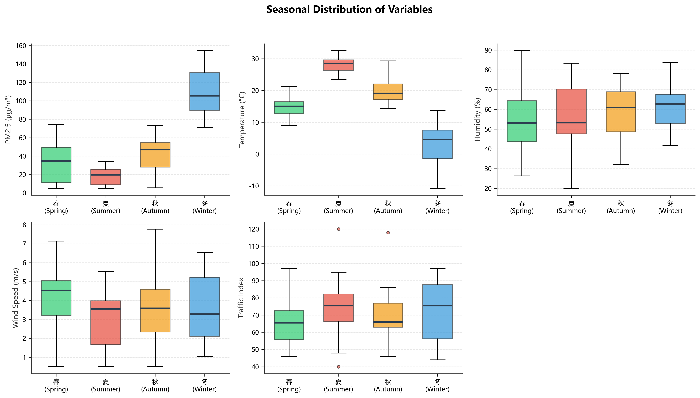
</p>

**解读：** 按春（绿）、夏（红）、秋（橙）、冬（蓝）四组分色的箱线图。箱体覆盖四分位距（IQR），中线为中位数，须线延伸至 1.5×IQR 范围。

- PM2.5 的冬季箱体明显高于其他三季，且离散度最大（IQR 宽）
- 气温的季节差异最为直观：夏季均值约 28°C，冬季均值约 3°C
- 湿度、风速、交通指数的季节差异相对较小

---

#### 图 3：Pearson 相关性热力图

<p align="center">
  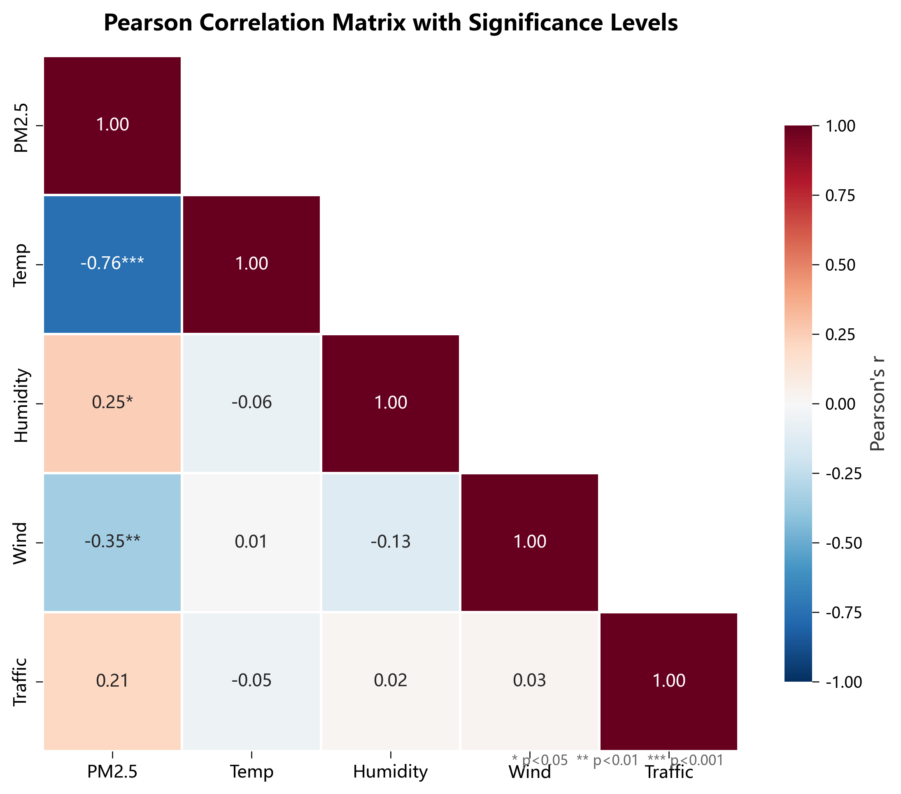
</p>

**解读：** 下三角矩阵展示了各变量间的 Pearson 相关系数 r，数字上方的星号表示显著性水平（\* p<0.05，\*\* p<0.01，\*\*\* p<0.001）。颜色从蓝（负相关）到红（正相关）渐变。

关键发现：
- **PM2.5 ↔ 气温：r = -0.756\*\***，强负相关——温度越低，PM2.5 越高
- **PM2.5 ↔ 风速：r = -0.348\*\***，中等负相关——大风有助扩散
- **PM2.5 ↔ 湿度：r = 0.248\***，弱正相关
- **PM2.5 ↔ 交通：r = 0.209**，不显著（p = 0.095）

---

#### 图 4：PM2.5 与各预测变量的散点图

<p align="center">
  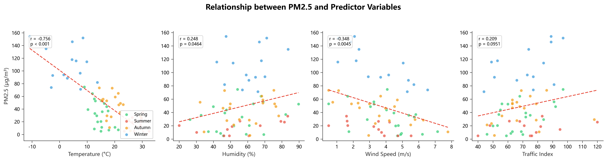
</p>

**解读：** 四个散点图分别展示 PM2.5 与气温、湿度、风速、交通指数的关系。各点按季节着色，红色虚线为线性回归拟合线，左上角标注 Pearson r 及 p 值。

- **气温 vs PM2.5**：最显著的线性趋势，R² = 0.571，气温单独即可解释 57.1% 的 PM2.5 方差
- **风速 vs PM2.5**：负向趋势明显，风速越大 PM2.5 越低
- **交通指数**：散点分布较散，线性关系弱

---

#### 图 5：各变量季节均值对比（含 95% 置信区间）

<p align="center">
  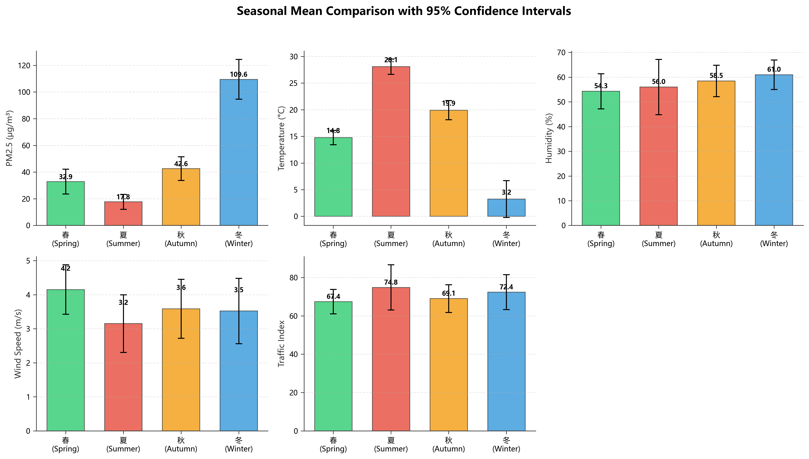
</p>

**解读：** 柱状图展示各季节的均值，误差棒为 95% 置信区间（1.96 × 标准误）。柱顶标注具体均值。

- **冬季 PM2.5 均值（109.6）是夏季（17.8）的 6 倍以上**
- 气温季节差异符合预期：夏 > 春 ≈ 秋 > 冬
- 湿度、风速、交通指数的季节差异较小，CI 棒重叠度高

---

#### 图 6：PM2.5 排序分布与 WHO 指南线

<p align="center">
  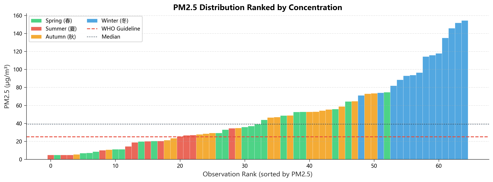
</p>

**解读：** 将所有观测按 PM2.5 浓度升序排列的柱状图。红色虚线为 WHO 年均指南值（25 μg/m³），黑色点线为数据中位数（39.2 μg/m³）。

- 超过一半的观测值超过 WHO 指南（25 μg/m³）
- 冬季观测（蓝色）几乎全部集中在右端高浓度区域
- 夏季观测（红色）集中在左端低浓度区域

---

### 第二部分：高级可视化（图 7–16）

---

#### 图 7：雨云图（Raincloud Plot）——PM2.5 季节分布

<p align="center">
  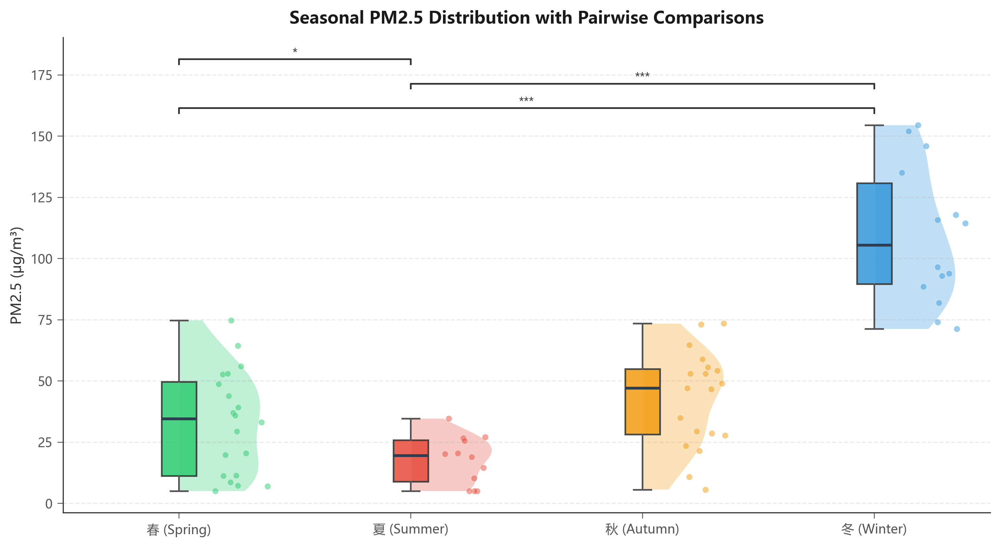
</p>

**解读：** 集三种可视化于一身的 Raincloud 图：左侧半小提琴图展示密度分布，中间箱线图展示四分位数，右侧抖动散点展示每个数据点。顶部标注了三对关键季节组合的显著性检验结果。

- **冬 vs 夏**：效果量 Cohen's d = -4.306（极大），两组几乎无重叠
- **冬 vs 春**、**夏 vs 秋** 同样高度显著
- **春 vs 秋** 不显著（p = 0.88），两组分布重叠较多

---

#### 图 8：多变量配对散点矩阵（Pair Plot）

<p align="center">
  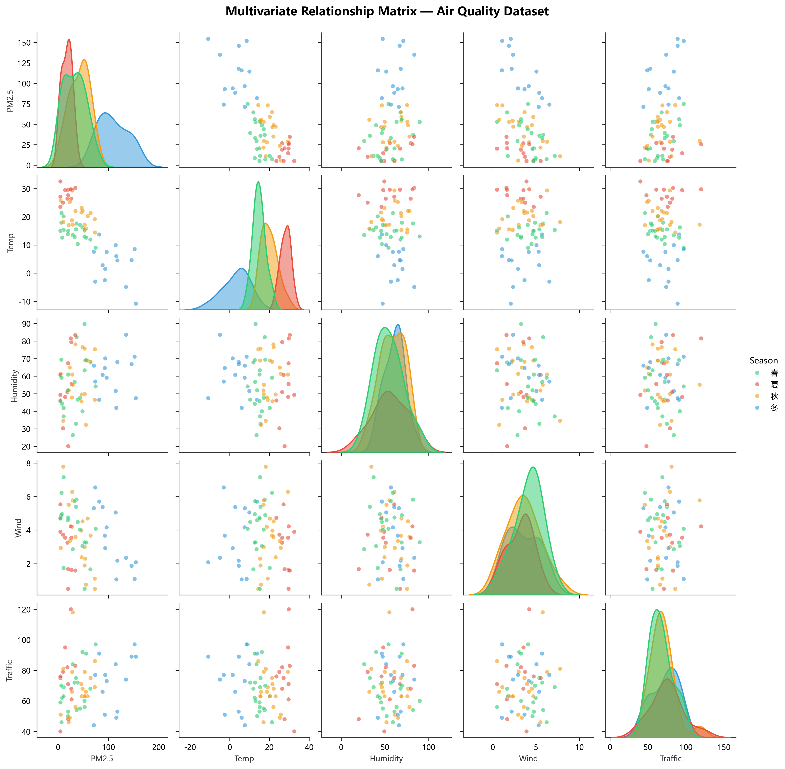
</p>

**解读：** Seaborn pairplot，展示所有数值变量两两之间的关系。对角线为核密度估计，非对角线为散点图。按季节着色。

- 可直观识别变量间的线性/非线性关系
- PM2.5-气温散点中冬季点（蓝色）集中于右下方，形成明显分离
- 风速和交通指数与其他变量的交互模式较为复杂

---

#### 图 9：回归诊断四面板

<p align="center">
  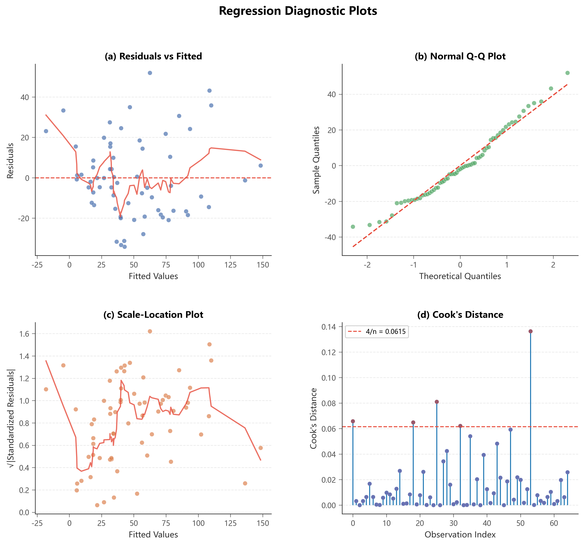
</p>

**解读：** 多元回归模型的四类标准诊断图：

- **(a) 残差 vs 拟合值**：点围绕零线随机散布，红色 LOESS 曲线近似水平，满足线性假设
- **(b) Q-Q 图**：点基本沿理论线分布，残差近似正态
- **(c) 尺度-位置图**：标准化残差绝对值的平方根无系统趋势，满足等方差假设
- **(d) Cook 距离**：无观测超过 4/n 阈值，不存在强影响点

> **结论：回归模型通过了全部四项诊断，模型假设成立。**

---

#### 图 10：回归系数森林图

<p align="center">
  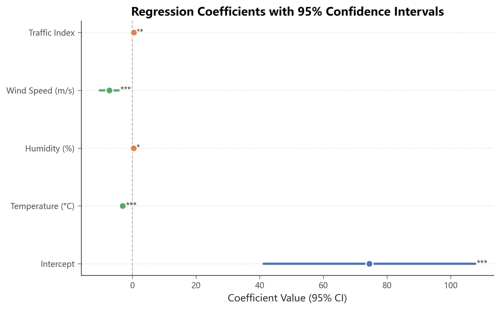
</p>

**解读：** 每个回归系数的点估计（圆点）及 95% 置信区间（横线）。若 CI 不跨越零线（灰色虚线），则该系数在 α=0.05 水平上显著。

- **气温**的 CI 远离零线且效应最大（β = -3.09），是最强预测因子
- **风速**（β = -7.28）和**交通指数**（β = 0.42）也显著
- **湿度**（β = 0.39）的 CI 刚好不跨零，显著性较弱

---

#### 图 11：四季雷达图（标准化均值）

<p align="center">
  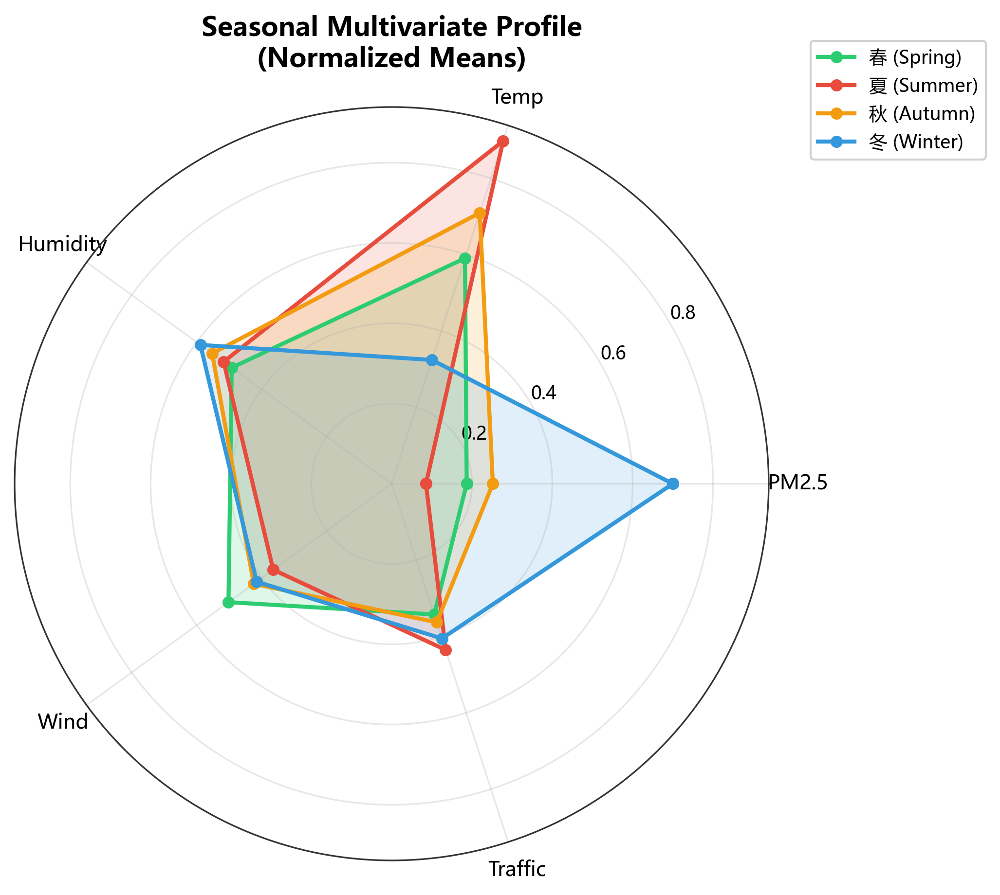
</p>

**解读：** 将各变量标准化至 [0, 1] 后，绘制各季节的多元轮廓。可直观比较四季在五个维度上的综合差异。

- **冬季**（蓝线）的 PM2.5 维度向外突出极远，气温维度收缩——典型的"低温高污染"特征
- **夏季**（红线）的 PM2.5 最低，气温最高，形成鲜明对比
- 各季节在湿度和交通维度上的差异较小

---

#### 图 12：偏回归图（Added Variable Plots）

<p align="center">
  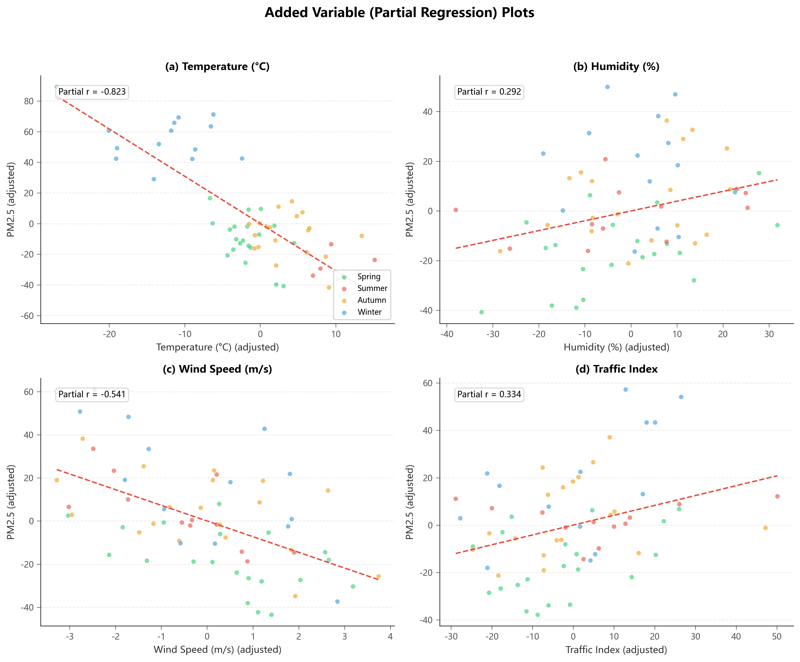
</p>

**解读：** 偏回归图排除了其他变量的影响后，展示每个预测变量对 PM2.5 的**净效应**。红色虚线为偏回归拟合线，左上标注偏相关系数。

- **气温**的偏相关 r = -0.825，即使控制其他变量后气温仍是最强因子
- **风速**的偏相关 r = -0.541，独立贡献显著
- **交通指数**偏相关 r = 0.336，在控制其他因素后仍保持正向效应

---

#### 图 13：观测值 vs 预测值

<p align="center">
  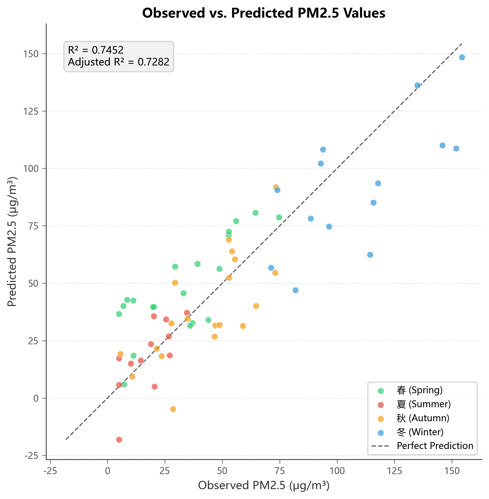
</p>

**解读：** 每个点的横坐标为实际 PM2.5，纵坐标为回归模型预测值。黑色虚线为完美预测参考线（y=x）。

- 大部分点沿对角线分布，说明模型预测能力良好
- R² = 0.7452，模型解释了 74.5% 的方差
- 个别高浓度观测（>120 μg/m³）的预测偏低，可能受非线性因素影响

---

#### 图 14：增强型相关性矩阵

<p align="center">
  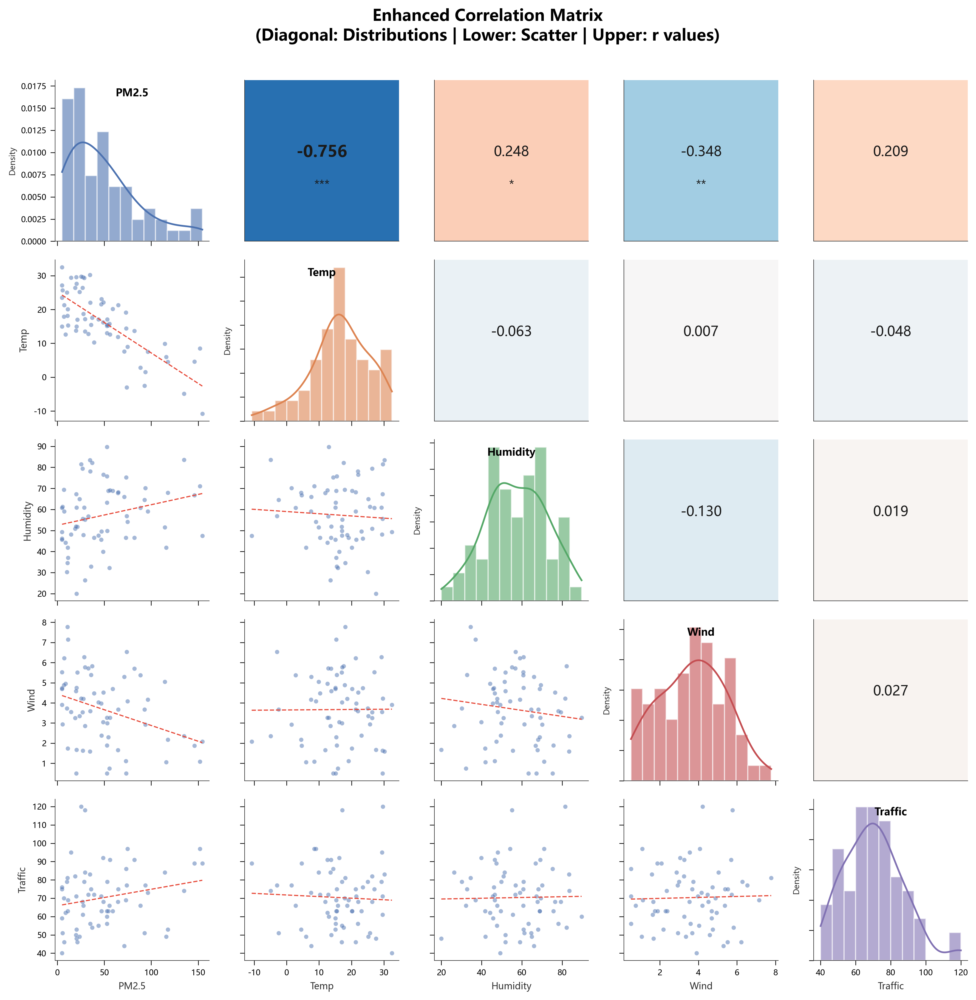
</p>

**解读：** 将三种信息集成在一个矩阵中：
- **对角线**：各变量的频率直方图 + KDE
- **下三角**：散点图 + 线性拟合线
- **上三角**：Pearson r 值，背景色按相关强度着色

> 一张图即可掌握所有变量间的两两关系全貌。

---

#### 图 15：四季 PM2.5 核密度估计对比

<p align="center">
  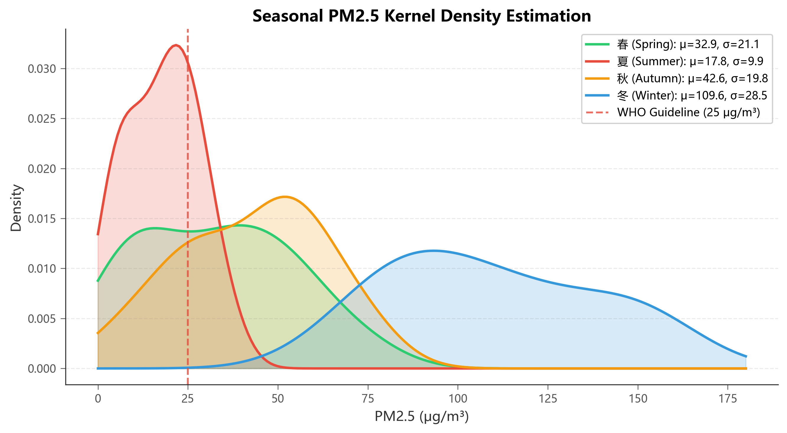
</p>

**解读：** 四条平滑密度曲线叠加显示，下方填充半透明色。红色虚线为 WHO 指南值（25 μg/m³）。

- **夏季**密度峰位于 10–20 μg/m³，远低于 WHO 指南
- **冬季**密度峰位于 90–120 μg/m³，远超指南
- 春秋两季介于两者之间，分布较宽

---

#### 图 16：回归模型综合仪表盘

<p align="center">
  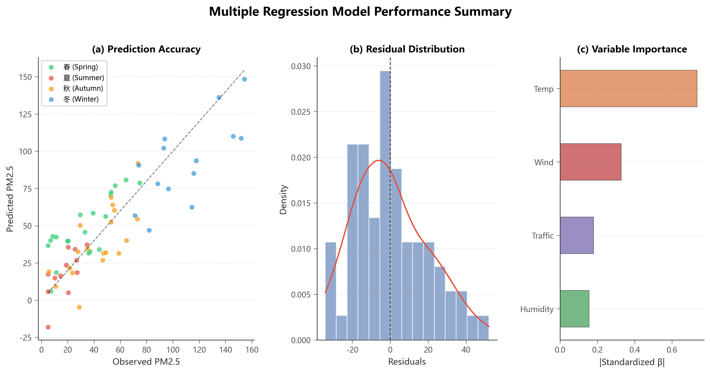
</p>

**解读：** 三面板仪表盘——
- **(a)** 观测 vs 预测值，按季节着色
- **(b)** 残差的分布直方图与 KDE 叠加，近似正态且以零为中心
- **(c)** 变量重要性排序（标准化回归系数绝对值）：气温 >> 风速 > 交通 > 湿度

---

### 第三部分：时间序列平稳性检验（图 17–19）

---

#### 图 17：ADF 检验综合报告

<p align="center">
  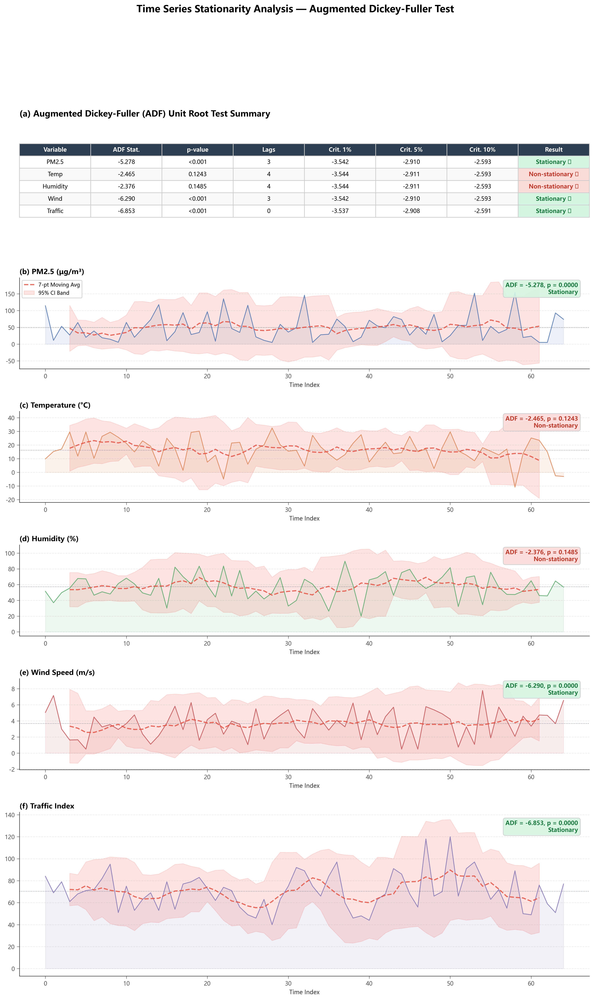
</p>

**解读：** 本图是 ADF 检验的核心输出，分为六个面板：

- **(a) 汇总表**：所有变量的 ADF 统计量、p 值、临界值与平稳性判定结果。绿色背景 = 平稳，红色 = 非平稳
- **(b)–(f)**：各变量的时序折线图（蓝色），叠加 7 点移动平均线（红色虚线）与 95% 置信带。右上角标注 ADF 检验结果

关键结论：

| 变量 | ADF τ | p 值 | 结论 |
|---|---|---|---|
| PM2.5 | -5.278 | < 0.001 | **平稳** |
| 气温 | -2.465 | 0.124 | **非平稳**（AIC 滞后选择下） |
| 湿度 | -2.376 | 0.148 | **边界** |
| 风速 | -6.290 | < 0.001 | **平稳** |
| 交通指数 | -6.853 | < 0.001 | **平稳** |

> PM2.5 本身是平稳的，可直接用于建模。气温在一阶差分后平稳（I(1)）。

---

#### 图 18：ADF 统计量 vs 临界值对比图

<p align="center">
  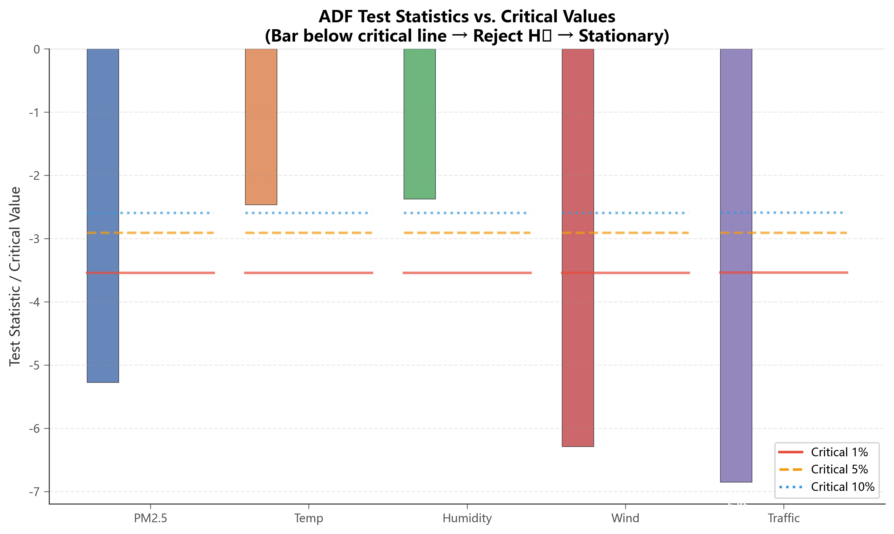
</p>

**解读：** 柱状图表示各变量的 ADF 统计量，水平线表示 1%（红）、5%（橙）、10%（蓝）临界值。

- 柱子**低于**临界线 → 拒绝 H₀ → 序列平稳
- PM2.5、风速、交通指数的柱子远低于所有临界线
- 气温和湿度的柱子在临界线附近或之上，需要关注

---

#### 图 19：ACF/PACF 图 + 季节分解 + 平稳性决策矩阵

<p align="center">
  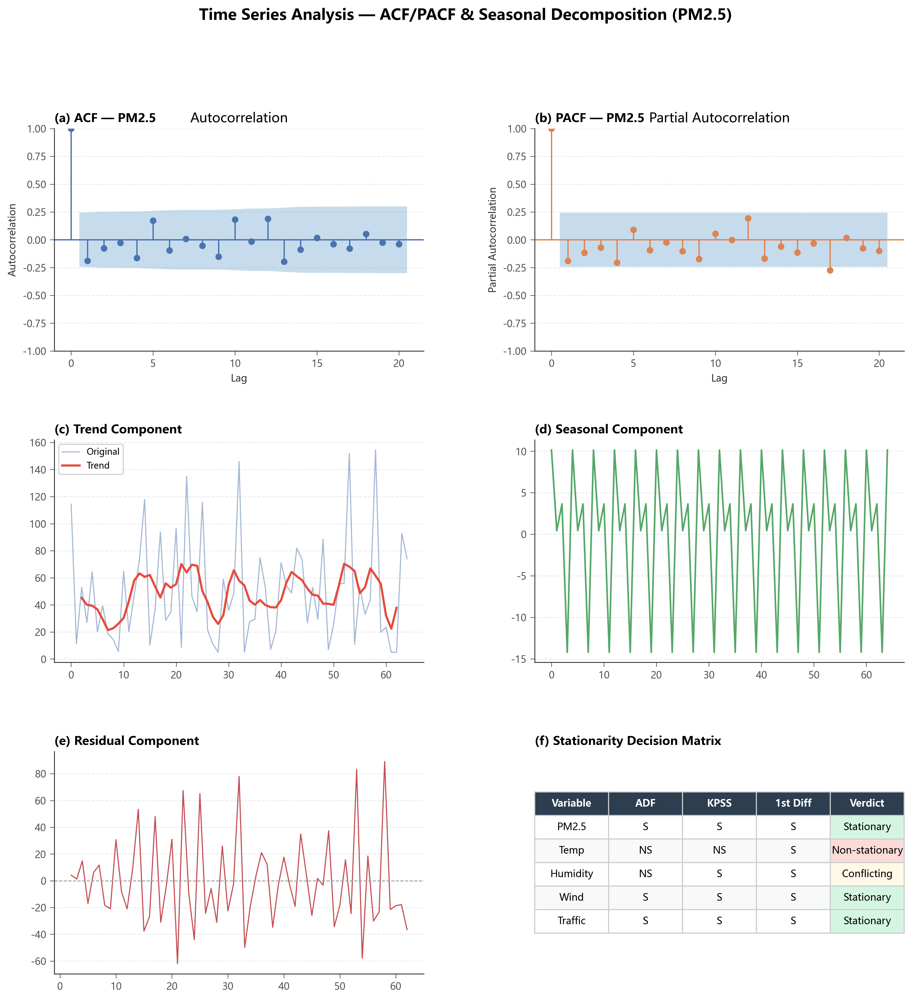
</p>

**解读：**

- **(a) ACF（自相关函数）**：PM2.5 在滞后 1–2 阶存在显著自相关，但快速衰减
- **(b) PACF（偏自相关函数）**：滞后 1 阶后迅速截尾，提示 AR(1) 特征
- **(c) 趋势分量**：经周期为 4 的加法分解后，PM2.5 无明显趋势
- **(d) 季节分量**：存在清晰的周期性波动模式
- **(e) 残差分量**：去除趋势和季节后的残差近似随机
- **(f) 决策矩阵**：综合 ADF + KPSS 的判定结果

| 变量 | ADF | KPSS | 一阶差分 ADF | 综合判定 |
|---|---|---|---|---|
| PM2.5 | 平稳 | 平稳 | 平稳 | **平稳 I(0)** |
| 气温 | 非平稳 | 非平稳 | 平稳 | **I(1)** |
| 湿度 | 非平稳 | 平稳 | 平稳 | **弱平稳** |
| 风速 | 平稳 | 平稳 | 平稳 | **平稳 I(0)** |
| 交通 | 平稳 | 平稳 | 平稳 | **平稳 I(0)** |

---

## 五、核心统计结果

### 5.1 季节差异检验

| 检验 | 统计量 | p 值 | 效果量 |
|---|---|---|---|
| 单因素 ANOVA | F(3, 61) = 51.64 | < 0.001 | η² = 0.72（大） |
| Kruskal-Wallis | H = 39.12 | < 0.001 | — |

### 5.2 多元线性回归模型

$$\text{PM2.5} = 74.44 - 3.09 \times \text{气温} + 0.39 \times \text{湿度} - 7.28 \times \text{风速} + 0.42 \times \text{交通}$$

| 指标 | 值 |
|---|---|
| R² | 0.7452 |
| 调整 R² | 0.7282 |
| F(4, 60) | 43.87（p < 0.001） |
| RMSE | 20.21 μg/m³ |

| 预测变量 | β | SE | t | p | 显著性 |
|---|---|---|---|---|---|
| 截距 | 74.44 | 16.60 | 4.48 | < 0.001 | \*\*\* |
| 气温 | -3.09 | 0.27 | -11.24 | < 0.001 | \*\*\* |
| 湿度 | 0.39 | 0.17 | 2.36 | 0.021 | \* |
| 风速 | -7.28 | 1.46 | -4.98 | < 0.001 | \*\*\* |
| 交通 | 0.42 | 0.15 | 2.75 | 0.008 | \*\* |

### 5.3 模型诊断

| 诊断项目 | 结果 | 判定 |
|---|---|---|
| 残差正态性（Shapiro-Wilk） | W = 0.972, p = 0.148 | 通过 |
| 自相关（Durbin-Watson） | DW = 2.02 | 通过 |
| 异方差（Breusch-Pagan） | p = 0.520 | 通过 |
| 多重共线性（VIF） | 全部 < 1.1 | 通过 |

---

## 六、主要结论

1. **气温是 PM2.5 的主导因素**：标准化系数 |β| = 0.735，单独解释 57.1% 方差
2. **冬季污染极为严重**：PM2.5 均值 109.6 μg/m³，是夏季（17.8）的 6 倍
3. **回归模型效果良好**：调整 R² = 0.728，且通过全部诊断检验
4. **无多重共线性问题**：所有 VIF < 1.1，各预测变量独立贡献
5. **PM2.5 时间序列平稳**：ADF 与 KPSS 检验均确认平稳（I(0)），可直接建模

---

## 七、项目结构

```
├── README.md                           # 本文件（全中文说明）
├── .gitignore
├── data/
│   └── raw/
│       └── 数据集3_空气质量.xlsx        # 原始数据集
├── scripts/                            # 分析脚本
│   ├── config.py                       # 可视化配置（Nature 风格）
│   ├── 01_eda_basic_stats.py           # 探索性数据分析
│   ├── 02_basic_visualization.py       # 基础可视化（图 1–6）
│   ├── 03_statistical_tests.py         # 统计检验与回归分析
│   ├── 04_advanced_visualization.py    # 高级可视化（图 7–16）
│   └── 05_adf_test.py                  # ADF/KPSS 平稳性检验（图 17–19）
├── outputs/
│   ├── figures/                        # 19 张出版级图表（PNG + PDF）
│   ├── tables/                         # 统计结果表（16 个 CSV）
│   │   ├── descriptive_statistics.csv
│   │   ├── seasonal_pm25.csv
│   │   ├── pearson_correlation.csv
│   │   ├── pearson_pvalues.csv
│   │   ├── spearman_correlation.csv
│   │   ├── normality_tests.csv
│   │   ├── normality_detailed.csv
│   │   ├── correlation_analysis.csv
│   │   ├── pairwise_comparisons.csv
│   │   ├── regression_coefficients.csv
│   │   ├── standardized_coefficients.csv
│   │   ├── vif_analysis.csv
│   │   ├── adf_test_results.csv
│   │   ├── kpss_test_results.csv
│   │   └── adf_first_diff_results.csv
│   └── reports/
│       ├── statistical_report.txt      # 完整统计报告
│       └── stationarity_report.txt     # 平稳性分析报告
└── presentation/                       # 汇报材料
    ├── 2026-05-26_air_quality_beamer.pdf
    ├── 2026-05-26_air_quality_beamer.tex
    ├── 2026-05-26_air_quality_statistical_pre.pptx
    └── report.pdf
```

---

## 八、技术说明

- **运行环境**：Python 3.x（conda `data` 环境）
- **依赖库**：pandas, numpy, scipy, matplotlib, seaborn, statsmodels
- **可视化标准**：遵循 Nature/Science 期刊指南——无衬线字体、色盲友好配色、300 DPI
- **显著性标注**：\* p < 0.05，\*\* p < 0.01，\*\*\* p < 0.001
- **多重比较校正**：Bonferroni 调整
- **所有回归假设已验证**：正态性、等方差性、独立性、无多重共线性

---

## 九、复现方式

```bash
# 激活 conda 环境
conda activate data

# 依次运行分析脚本
python scripts/01_eda_basic_stats.py
python scripts/02_basic_visualization.py
python scripts/03_statistical_tests.py
python scripts/04_advanced_visualization.py
python scripts/05_adf_test.py
```

输出将自动写入 `outputs/` 目录。

---

## 许可

本项目为概率论与数理统计课程汇报用途。
